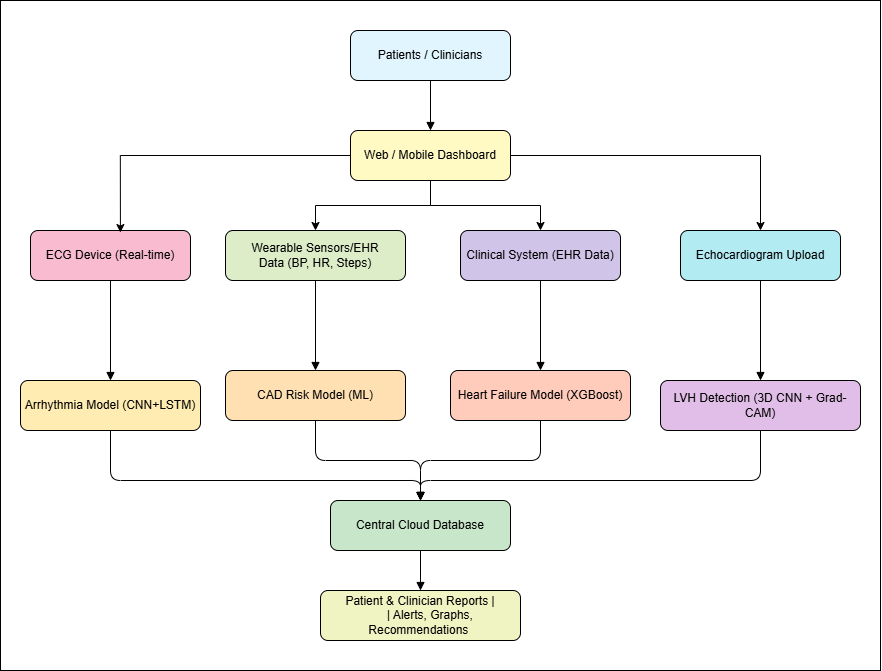

# Reserach-Project-25-26J-315
# AI-Based Systems for Heart Disease Detection and Risk Assessment

## Project Overview

This project focuses on designing and developing **AI-powered, explainable, and scalable healthcare systems** for the early detection of major heart diseases and cardiovascular risk assessment. The systems aim to overcome limitations of traditional and black-box AI models by introducing **Explainable AI (XAI)**, **real-time data processing**, and **clinician-friendly interfaces** to improve trust, accuracy, and usability in real-world healthcare environments.

---

## Research Components & AI Models

The project consists of multiple research-driven components, each targeting a specific heart condition using advanced AI techniques:

1. **Arrhythmia Detection (ECG-Based)**

   * Hybrid **CNN–LSTM** deep learning model
   * Explainability using **Grad-CAM and SHAP**

2. **Heart Failure Risk Prediction (EHR-Based)**

   * Ensemble learning using **XGBoost**
   * Risk probability calibration with **SHAP explanations**

3. **Coronary Artery Disease (CAD) Risk Prediction**

   * Machine learning models with **SHAP and LIME**
   * Clinical and lifestyle data analysis

4. **Left Ventricular Hypertrophy (LVH) Detection**

   * **3D Convolutional Neural Network (X3D-M)**
   * Echocardiogram video-based classification

---

## Main Objectives

* Detect major heart diseases accurately and at an early stage
* Improve **clinical trust** through Explainable AI
* Enable **real-time or near real-time decision support**
* Reduce subjectivity in manual diagnosis
* Provide scalable and reusable AI healthcare solutions

---

## Target Users / Stakeholders

* **Cardiologists & Medical Officers** – clinical decision support
* **Hospitals & Clinics** – diagnostic assistance systems
* **Patients** – early risk awareness and monitoring
* **Researchers & Students** – AI healthcare research
* **Healthcare Administrators** – data-driven planning

---

## High-Level System Functionality

1. Data collection from medical sources (ECG, EHR, echo videos)
2. Data preprocessing and normalization
3. AI model inference for disease detection or risk prediction
4. Explainable AI module generates human-understandable explanations
5. Results visualized through an interactive web dashboard
6. Risk scores and alerts provided for clinical action

---

## System Architecture (React + Python)

  

*Figure: High-level system architecture illustrating data sources (ECG devices, wearables, EHR systems, echocardiograms), AI/ML models, cloud backend, and user-facing dashboards.*

### Architecture Description

* **Frontend (React.js)**

  * Web and mobile dashboard used by patients and clinicians
  * Displays ECG signals, prediction results, risk scores, alerts, and XAI visualizations

* **Data Sources**

  * Real-time ECG devices for arrhythmia detection
  * Wearable sensors and EHR data (BP, HR, steps) for CAD risk analysis
  * Clinical EHR systems for heart failure prediction
  * Echocardiogram uploads for LVH detection

* **Backend (Python Services)**

  * REST APIs for data ingestion and inference
  * Hosts multiple AI models (CNN–LSTM, XGBoost, ML, 3D CNN)
  * Integrates Explainable AI modules (SHAP, Grad-CAM, LIME)

* **Cloud Layer**

  * Central cloud database for storing patient data and predictions
  * Secure data access and scalability

* **Output Layer**

  * Patient and clinician reports
  * Alerts, graphs, and recommendations

---

## AI / ML Backend (backend-python)

* Frameworks: TensorFlow, Keras, PyTorch, Scikit-learn
* Models:

  * CNN–LSTM (Arrhythmia Detection)
  * XGBoost Ensemble (Heart Failure Risk)
  * ML + SHAP/LIME (CAD Risk)
  * 3D CNN X3D-M (LVH Detection)
* Explainability Tools: SHAP, Grad-CAM, LIME
* Data Handling: NumPy, Pandas

---

## Expected Outcomes

* Accurate detection of multiple heart conditions
* Transparent and explainable predictions
* Increased clinician confidence in AI systems
* Early diagnosis leading to better patient outcomes
* Foundation for real-world clinical deployment

---

## Contributors and Assigned Components

* **H P A S Weerasinghe (IT22337894)**
  *Component:* IoT-Enabled Real-Time ECG Monitoring & Arrhythmia Detection

* **W A V R Wijesinghe (IT22902252)**
  *Component:* Heart Failure Detection & Risk Assessment using EHR Data

* **A M C R H Rathnayaka (IT22026798)**
  *Component:* Coronary Artery Disease Risk Prediction using Explainable AI

* **W D T D P Wijesooriya (IT22644244)**
  *Component:* Left Ventricular Hypertrophy Detection using Echocardiogram Videos

---

## License

This project is developed for **academic and research purposes** under the Information Technology degree program (Batch 25–26J-315).
